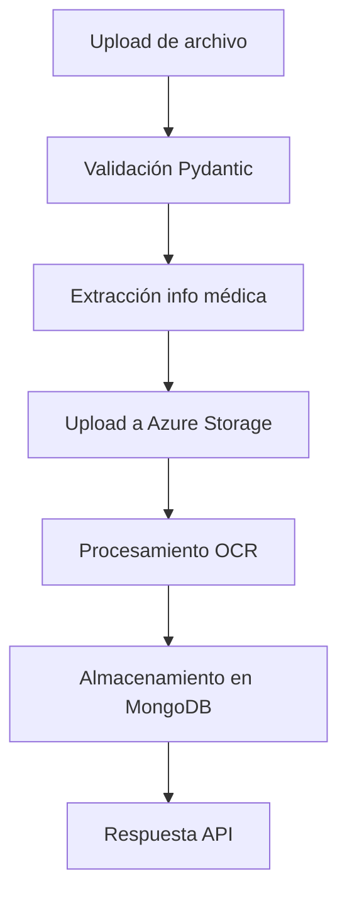

# TecSalud MVP - Sistema de Procesamiento de Documentos Médicos

Sistema FastAPI para procesamiento automatizado de documentos médicos con extracción de información, OCR y almacenamiento en MongoDB.

## 🚀 Características

- **Procesamiento de documentos médicos** con extracción automática de información del nombre del archivo
- **OCR (Reconocimiento Óptico de Caracteres)** usando Azure Document Intelligence
- **Almacenamiento en Azure Storage** con operaciones batch optimizadas
- **Base de datos MongoDB** con indexación para búsquedas eficientes
- **Procesamiento en paralelo** para uploads masivos
- **Validación de datos** con Pydantic
- **Logging estructurado** para monitoreo y debugging
- **APIs RESTful** completamente documentadas

## 📋 Requisitos

- Python 3.8+
- MongoDB
- Azure Storage Account
- Azure Document Intelligence Service

## 🛠️ Instalación

1. **Clonar el repositorio**
```bash
git clone https://github.com/josecaldasai/tecsaludmvp.git
cd tecsaludmvp
```

2. **Instalar dependencias**
```bash
pip install -r requirements.txt
```

3. **Configurar variables de entorno**
```bash
cp .env.example .env
# Editar .env con tus credenciales
```

## ⚙️ Configuración

### Variables de Entorno

```env
# Azure Storage
AZURE_STORAGE_CONNECTION_STRING=your_connection_string
AZURE_STORAGE_CONTAINER_NAME=documents

# Azure Document Intelligence
AZURE_DOCUMENT_INTELLIGENCE_ENDPOINT=your_endpoint
AZURE_DOCUMENT_INTELLIGENCE_KEY=your_key

# MongoDB
MONGODB_CONNECTION_STRING=your_mongodb_connection
MONGODB_DATABASE_NAME=tecsalud_chatbot
MONGODB_COLLECTION_NAME=documents

# Configuración de procesamiento
AZURE_STORAGE_MAX_WORKERS=8
AZURE_STORAGE_CHUNK_SIZE=4194304
BATCH_MAX_WORKERS=4
```

### Formato de Archivos Médicos

El sistema extrae información automáticamente de nombres de archivos con el formato:
```
{expediente}_{nombre_paciente}_{numero_episodio}_{categoria}.pdf
```

Ejemplo:
```
3000128494_ALANIS VILLAGRAN, MARIA DE LOS ANGELES_2003091464_EMER.pdf
```

## 🚀 Uso

### Ejecutar el servidor

```bash
python main.py
```

El servidor estará disponible en `http://localhost:8000`

### Documentación API

- **Swagger UI**: `http://localhost:8000/docs`
- **ReDoc**: `http://localhost:8000/redoc`

### Endpoints Principales

#### 1. Subir documento individual
```http
POST /api/v1/documents/upload
Content-Type: multipart/form-data

file: archivo.pdf
user_id: "usuario123" (opcional)
description: "Descripción del documento" (opcional)
tags: ["tag1", "tag2"] (opcional, JSON array)
```

#### 2. Subir documentos en lote
```http
POST /api/v1/documents/upload/batch
Content-Type: multipart/form-data

files[]: archivo1.pdf
files[]: archivo2.pdf
user_id: "usuario123" (opcional)
batch_description: "Descripción del lote" (opcional)
batch_tags: ["tag1", "tag2"] (opcional, JSON array)
```

#### 3. Listar documentos
```http
GET /api/v1/documents/
?user_id=usuario123
&batch_id=batch-uuid
&limit=10
&skip=0
```

#### 4. Obtener documento específico
```http
GET /api/v1/documents/{document_id}
```

#### 5. Eliminar documento
```http
DELETE /api/v1/documents/{document_id}
```

## 🏗️ Arquitectura

### Componentes Principales

1. **Router** (`app/apis/v1/router.py`): Endpoints API con validación Pydantic
2. **DocumentProcessor** (`app/core/v1/document_processor.py`): Orquestador del flujo de procesamiento
3. **StorageManager** (`app/core/v1/storage_manager.py`): Gestión de Azure Storage
4. **OCRManager** (`app/core/v1/ocr_manager.py`): Extracción de texto con Azure Document Intelligence
5. **MongoDBManager** (`app/core/v1/mongodb_manager.py`): Operaciones de base de datos
6. **MedicalFilenameParser** (`app/core/v1/filename_parser.py`): Extracción de información médica

### Flujo de Procesamiento



## 🔧 Desarrollo

### Estructura del Proyecto

```
tecsaludmvp/
├── app/
│   ├── apis/v1/
│   │   ├── router.py          # Endpoints API
│   │   ├── types_in.py        # Modelos de entrada
│   │   └── types_out.py       # Modelos de salida
│   ├── core/v1/
│   │   ├── document_processor.py  # Procesador principal
│   │   ├── storage_manager.py     # Gestión Azure Storage
│   │   ├── ocr_manager.py         # Procesamiento OCR
│   │   ├── mongodb_manager.py     # Operaciones MongoDB
│   │   ├── filename_parser.py     # Parser información médica
│   │   ├── exceptions.py          # Excepciones personalizadas
│   │   └── log_manager.py         # Sistema de logging
│   └── env/v1/
│       └── environment.py     # Configuración de entorno
├── main.py                    # Punto de entrada
├── requirements.txt           # Dependencias
├── .env.example              # Variables de entorno ejemplo
└── README.md                 # Este archivo
```

### Optimizaciones Implementadas

1. **Azure Storage Batch Upload**: Subida paralela con ThreadPoolExecutor
2. **MongoDB Bulk Operations**: Inserción masiva con `insert_many()`
3. **Procesamiento Paralelo**: Hasta 8 workers para Azure Storage
4. **Indexación MongoDB**: Índices optimizados para búsquedas médicas
5. **Validación Pydantic**: Validación automática de datos de entrada
6. **Logging Estructurado**: Trazabilidad completa del procesamiento

## 📊 Rendimiento

- **Azure Storage**: 3-5x más rápido con batch upload
- **MongoDB**: 2-3x más rápido con operaciones bulk
- **Procesamiento General**: 4-8x mejora en lotes grandes
- **Throughput**: Hasta 0.16 documentos/segundo en batch

## 🧪 Testing

```bash
# Ejecutar pruebas
pytest tests/

# Con coverage
pytest --cov=app tests/
```

## 📝 Logging

El sistema incluye logging estructurado con:
- Timestamps precisos
- Niveles de log (INFO, WARNING, ERROR)
- Contexto de procesamiento
- Métricas de rendimiento
- Trazabilidad de errores

## 🛡️ Seguridad

- Variables de entorno para credenciales
- Validación de tipos de archivo
- Manejo seguro de errores
- Logs sin información sensible

## 📈 Monitoreo

El sistema registra métricas de:
- Tiempo de procesamiento
- Tasas de éxito/fallo
- Rendimiento de Azure Storage
- Operaciones de MongoDB
- Errores y excepciones

## 🤝 Contribución

1. Fork el repositorio
2. Crear una rama para tu feature (`git checkout -b feature/nueva-funcionalidad`)
3. Commit tus cambios (`git commit -am 'Agregar nueva funcionalidad'`)
4. Push a la rama (`git push origin feature/nueva-funcionalidad`)
5. Crear un Pull Request

## 📄 Licencia

Este proyecto está bajo la Licencia MIT - ver el archivo [LICENSE](LICENSE) para más detalles.

## 🆘 Soporte

Para soporte técnico o preguntas:
- Crear un issue en GitHub
- Contactar al equipo de desarrollo

---

**TecSalud MVP** - Sistema de Procesamiento de Documentos Médicos con IA 